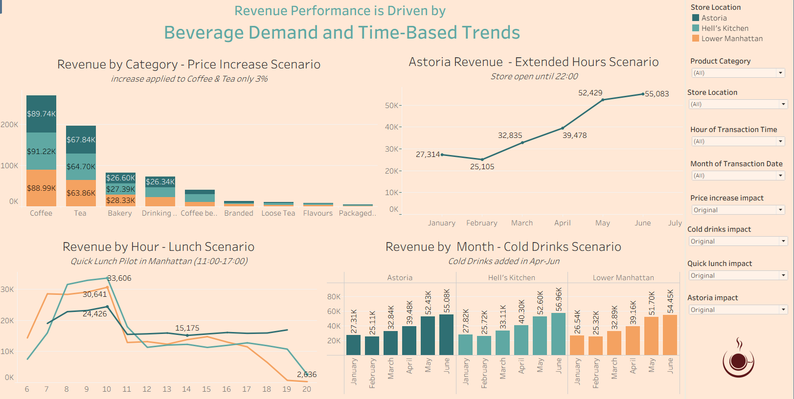

# Coffee Shop Sales Analysis

End-to-end data analysis project for a coffee shop sales dataset, built as part of a Data Analyst course.

The project combines Python-based data cleaning and exploratory analysis with a Tableau workbook for the main calculations, visual storytelling, and business scenarios. The final deliverable is a polished dashboard and a set of practical recommendations for improving revenue and store performance.

## Repository Contents

- `Coffee Shop Sales.xlsx` - source dataset used as the starting point for the analysis
- `Coffee shop sales_new_23.04.26.twbx` - Tableau packaged workbook containing the dashboard, embedded extract, and calculations
- `Python/` - Python notebooks for data cleaning and EDA
- `Maven-Roasters.pptx` - presentation deck used to present the findings

## Tools Used

- Python
- Pandas
- NumPy
- Мatplotlib.pyplot
- Tableau
- Microsoft Excel
- Gamma

## Business Objective

Analyze coffee shop sales to identify demand patterns, top-performing stores and products, and practical opportunities to improve revenue.

## Workflow

1. **Data cleaning in Python**
   - removed noise and prepared the dataset for analysis
   - checked column structure, data types, and missing or inconsistent values

2. **Exploratory Data Analysis**
   - explored revenue, quantity, time-based trends, and category-level behavior
   - identified the strongest and weakest product / store patterns

3. **Tableau dashboard development**
   - built the main calculations and visual layers in Tableau
   - created views for revenue by day, month, hour, store, category, and product
   - added scenario-based sheets such as price increase and extended-hours analysis

4. **Business recommendations**
   - turned the analysis into actionable suggestions
   - where the dataset was not fully complete, some recommendations were supported by external sources and LLM-assisted research

## Key Insights

- peak hours and time windows with the highest sales activity
- differences in performance between stores and product categories
- top and bottom products by revenue or quantity
- pricing inconsistencies and potential pricing opportunities
- scenario analysis for improving revenue through pricing or operating-hour changes

## Important Note

The source data was not fully complete, so the final recommendations should be interpreted with that limitation in mind. Some suggestions were based partly on internet research and LLM-assisted reasoning to complement the missing data. This is stated transparently so the project stays honest and presentation-ready.

## Tableau Dashboard Preview

## Summary & Recommendations

The analysis shows that sales strengthen as the business moves into the warmer months, with the busiest activity concentrated in the morning. Beverage products drive most of the demand, which points to a clear core purchasing pattern. Based on these findings, the main recommendations are to test higher prices on best-selling items, expand seasonal cold-drink options in spring and summer, align operating hours with peak demand, and broaden the food offering where breakfast and lunch traffic is strongest.

